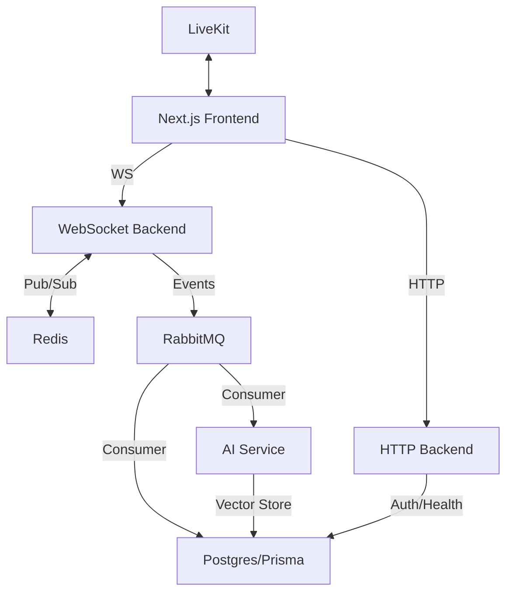

# Pencil.io

**Pencil.io** is a high-performance, distributed, real-time collaborative platform. It combines a custom CRDT-based canvas, instant messaging, and multi-user video conferencing (via LiveKit) with an advanced AI-driven transcription and summarization engine.

Built with a focus on **concurrency, observability, and resilience**, Pencil.io is architected as a production-ready monorepo using Turborepo and a microservices-based backend.

---

## 🏗 System Architecture

The system is designed for massive scale, utilizing a decoupled, event-driven architecture.

### **High-Level Topology**


- **HTTP Backend (Express):** Manages Auth, Room lifecycle, and LiveKit token minting.
- **WebSocket Backend (ws):** Handles presence, real-time CRDT synchronization, and event fan-out.
- **AI Service (Node.js):** Performs background ingestion, RAG (Retrieval-Augmented Generation), and session summarization.
- **Transcript Service (Python):** Specialized agent for real-time speech-to-text processing via LiveKit.
- **Shared Packages:** Optimized monorepo architecture with shared `@repo/db`, `@repo/common`, `@repo/messaging`, and `@repo/validation`.

---

## 🚀 Key Engineering Features

### **1. Real-Time Consistency & CRDTs**
*   **Conflict-Free Replication:** Utilizes a custom CRDT (Conflict-free Replicated Data Type) engine to allow simultaneous drawing without data loss.
*   **Hybrid Logical Clocks (HLC):** Implements HLC to provide causality tracking and deterministic event ordering across distributed service instances.
*   **Replayability:** Every state change is backed by an event log, allowing for full state reconstruction and session replay.

### **2. Infrastructure Resilience & Security**
*   **Hardened Security:** Integrated **Helmet.js** for secure HTTP headers, protecting against XSS, clickjacking, and MIME-sniffing.
*   **Distributed Rate Limiting:** Redis-backed rate limiting (`express-rate-limit` + `rate-limit-redis`) across all instances to prevent resource exhaustion and brute-force attacks.
*   **Deep Health Checks:** Advanced `/health` monitoring that verifies the status of downstream dependencies (PostgreSQL, Redis, RabbitMQ) rather than just the service status.

### **3. Observability & Self-Documentation**
*   **Structured Logging:** Standardized **Pino** logging across all services. Logs are JSON-formatted and include contextual metadata (`roomId`, `traceId`) for easy ingestion into ELK/DataDog.
*   **Interactive API Docs:** Auto-generated **OpenAPI/Swagger** documentation available at `/api-docs` for real-time testing and seamless frontend-backend integration.

### **4. AI-Driven Insights**
*   **Timeline Ingestion:** Real-time event streams are processed into vector embeddings.
*   **RAG Querying:** Users can query the room's history using natural language, powered by Google Gemini and specialized vector search.

---

## 🛠 Tech Stack

### **Infrastructure**
- **Turborepo** — Monorepo orchestration
- **pnpm workspaces** — Package management
- **Docker + Docker Compose** — Containerized local infrastructure
- **GitHub Actions** — Automated CI/CD (Lint, Type-check, Test, Build)

### **Backend**
- **Node.js (TypeScript)** / **Python** (Transcript)
- **Express** / **FastAPI**
- **RabbitMQ** — Event-driven messaging
- **Redis** — Distributed locks and Pub/Sub
- **PostgreSQL + Prisma** — High-performance ORM and Vector Store
- **Vitest** — Modern testing framework for unit and integration tests

### **Frontend**
- **Next.js 16 (App Router)** + **React 19**
- **TailwindCSS** + **Zustand**
- **LiveKit Client** — Low-latency WebRTC media engine

---

## 🚦 Getting Started

### 1. Install Dependencies
```bash
pnpm install
```

### 2. Infrastructure
```bash
docker compose up -d
```
Starts PostgreSQL (with `pgvector`), Redis, RabbitMQ, and LiveKit.

### 3. Database Setup
```bash
cd packages/db && pnpm prisma migrate dev
```

### 4. Run Services
```bash
pnpm dev
```

| Service | Endpoint | Port |
|---|---|---|
| Web App | `http://localhost:3000` | 3000 |
| API Docs | `http://localhost:3001/api-docs` | 3001 |
| HTTP Health | `http://localhost:3001/health` | 3001 |
| WS Health | `http://localhost:3003/health` | 3003 |

---

## 🛡 Security & Quality Gates (CI/CD)

The project enforces strict quality gates on every Pull Request via **GitHub Actions**:

- ✅ **Linting:** Code style consistency (ESLint/Prettier).
- ✅ **Type Checking:** Full TypeScript validation across the workspace.
- ✅ **Automated Testing:** Unit and Integration tests (Vitest).
- ✅ **Build Validation:** Ensures production builds are successful.

---

## 📈 Database Optimization
Pencil.io utilizes optimized PostgreSQL indexing strategies:
- **Composite Indexes:** Optimized for room-based chronological fetching (`roomId`, `createdAt`).
- **Vector Search:** `pgvector` enabled for high-dimensional embedding similarity searches.
- **Snapshotting:** Regular base-layer snapshots to minimize CRDT merge latency.

---

## 📝 Contributors Note
- All new real-time features must pass through the **RabbitMQ Event Pipeline**.
- Maintain deterministic CRDT logic; use the provided `Vitest` suite for new handlers.
- Add OpenAPI annotations for all new HTTP endpoints.
